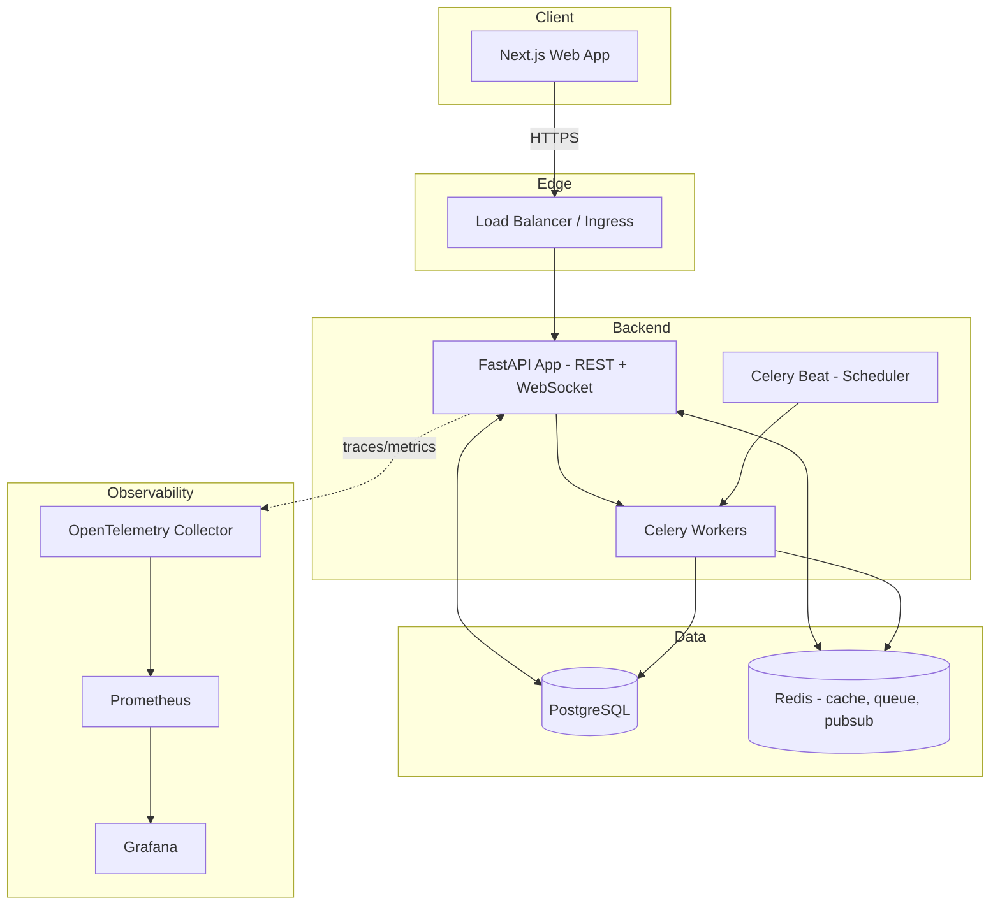

# Architecture

**Status:** Living document. Update whenever a structural decision is made.

---

## 1. Tech Stack

**Frontend:** Next.js, React, TypeScript, Tailwind CSS, shadcn/ui, React Query, Framer Motion
**Backend:** FastAPI, Python, SQLAlchemy, Alembic, PostgreSQL, Redis, Celery, WebSockets
**Auth:** JWT, OAuth (Google, Microsoft)
**Infra:** Docker, Kubernetes, GitHub Actions, Prometheus, Grafana, OpenTelemetry

## 2. High-Level System Diagram



## 3. Backend Architecture — Clean Architecture / DDD

Layered, dependency-inverted, feature-modular. Each bounded context is a
Python package with its own layers:

```
apps/api/
  src/
    modules/
      identity/           # users, orgs, workspaces, auth, RBAC
        domain/            # entities, value objects, domain services (no framework deps)
        application/        # use cases / command & query handlers, DTOs
        infrastructure/     # SQLAlchemy repositories, external services
        api/                 # FastAPI routers, request/response schemas
      projects/            # workspace -> portfolio -> project -> work items
        domain/
        application/
        infrastructure/
        api/
      requirements/        # requirements module + traceability
        domain/
        application/
        infrastructure/
        api/
      scrum/                # sprints, backlog, ceremonies (Phase 2)
      analytics/            # reporting, dashboards (Phase 3)
      ai/                    # AI assistant, briefing (Phase 4/5)
      automation/           # rule engine (Phase 6)
      integrations/         # GitHub/Slack/etc (Phase 6)
    shared_kernel/          # cross-module value objects (ids, pagination, errors)
    platform/               # DB session mgmt, config, logging, telemetry, DI container
  alembic/
  tests/
    unit/
    integration/
```

**Rules:**
- `domain/` has zero framework imports (no SQLAlchemy, no FastAPI). Pure Python + Pydantic value objects.
- `application/` orchestrates domain logic via repository interfaces (ports), never talks to SQLAlchemy directly.
- `infrastructure/` implements the repository interfaces (adapters).
- `api/` is the only layer that knows about HTTP/FastAPI.
- Modules communicate through application-layer interfaces or domain events — never by importing another module's `infrastructure/`.
- Repository Pattern + Dependency Injection throughout (FastAPI `Depends` wiring to a DI container).

## 4. Frontend Architecture

```
apps/web/
  app/                      # Next.js App Router
    (dashboard)/
    (auth)/
  components/
    ui/                     # shadcn/ui primitives — the ONLY place base components live
    shared/                 # composed shared components (ProgressRing, WorkItemCard, etc.)
  features/                 # feature-sliced modules (mirrors backend modules)
    requirements/
    work-items/
    boards/
    dashboard/
  lib/                      # api client, query hooks, utils
  styles/                   # design tokens, tailwind config extensions
```

- Design system components live once in `components/ui` and `components/shared`; features
  compose them, never re-implement them (see PRD §UI Consistency Rule in the platform brief).
- React Query owns all server state; no ad hoc `useEffect` fetching.
- API contracts are the single source of truth for TS types (generated from OpenAPI schema, see §6).

## 5. API Versioning

All routes under `/api/v1/...`. Breaking changes require `/api/v2/...` — old
versions stay live until deprecation is announced and clients migrate. See
[`API_CONTRACTS.md`](API_CONTRACTS.md).

## 6. Type Safety Across the Stack

FastAPI generates an OpenAPI schema → `openapi-typescript` generates frontend
types at build time. No hand-maintained duplicate DTOs.

## 7. Work Item Hierarchy — Modeling Decision

**Decision:** A single `work_items` table with a `type` discriminator column
(`EPIC | FEATURE | STORY | TASK | SUBTASK | CHECKLIST_ITEM`), a self-referential
`parent_id`, and a **materialized path** (`path` = ltree or delimited string of
ancestor ids) plus `depth`, rather than one table per hierarchy level.

**Why:** Unlimited nesting is a hard requirement. A table-per-level design
can't support arbitrary depth without recursive joins across N tables. A
single polymorphic table with a materialized path gives:
- O(1) "get all descendants" via `path LIKE 'x.y.%'` (indexed)
- O(1) "get all ancestors" by splitting `path`
- Cheap progress rollup (see §8)
- One place to add shared fields (comments, attachments, custom fields) via
  polymorphic association, instead of duplicating across level-specific tables

`Milestone` and `Portfolio` are structurally similar but semantically
distinct from the Epic→Checklist work chain (a Milestone is a date-anchored
marker that groups work items rather than being worked on directly). They
get their own tables that reference `project_id` and can be linked to
work items via `milestone_id` on `work_items`, rather than being folded into
the `work_items` type enum. Full schema in [`DATABASE_SCHEMA.md`](DATABASE_SCHEMA.md).

## 8. Progress Rollup

Rollup is computed bottom-up on write, not on read:
- On a work item status/progress change, a domain event (`WorkItemProgressChanged`)
  fires.
- An application-layer handler recomputes the immediate parent's progress
  (weighted by children's story points if present, else equal weight).
- This cascades up the `parent_id` chain to the project root.
- Recomputation is synchronous for the immediate parent (fast, needed for UI
  responsiveness) and cascades further up via a Celery task to avoid blocking
  the request on deep trees.
- `progress_override` (nullable float) on `work_items`: when set, automatic
  rollup skips that node's computed value but still cascades upward using the
  override as the effective value.

## 9. Requirements vs. Work Items — Traceability Model

Requirements are **not** a level in the work item tree. They are a standalone
entity (`requirements` table) linked to any number of work items via a
join table (`requirement_work_item_links`), because:

- One requirement can generate multiple tasks (1:N)
- One task may satisfy multiple requirements (N:1)
- The relationship is genuinely many-to-many

The "User Story" **requirement type** (`requirements.type = 'USER_STORY'`) is
distinct from the "User Story" **work item type** (`work_items.type = 'STORY'`).
A requirement of type User Story typically links to one or more Story work
items that implement it, but they are different rows in different tables.
This is called out explicitly because the platform brief uses "User Story" in
both contexts — this doc is the disambiguation source of truth.

## 10. Extensibility (why Phase 1 doesn't box in later phases)

- **AI module (Phase 4/5):** consumes the same application-layer use cases
  (`CreateWorkItem`, `LinkRequirement`, etc.) that the REST API uses — AI is
  just another caller, not a special code path.
- **Automation (Phase 6):** domain events already fire on state changes
  (§8); the automation engine subscribes to the same event bus (Redis
  pub/sub) rather than requiring new instrumentation.
- **Portfolio/OKRs/multi-workspace (Phase 7):** `organization_id` is on every
  root aggregate from day one, even though Phase 1 UI only exposes a single
  workspace per org — no future migration needed to retrofit multi-tenancy.
- **Integrations (Phase 6):** work items get a generic `external_links` table
  (`source`, `external_id`, `external_url`) from Phase 1, unpopulated until
  Phase 6 wires up GitHub/GitLab/etc.

## 11. Environments & Deployment

- Local dev: `docker-compose.yml` (Postgres, Redis, API, web, worker)
- CI: GitHub Actions — lint, typecheck, unit tests, integration tests against
  ephemeral Postgres, build images
- Prod: Kubernetes manifests (Phase 1 can run as a single-replica deployment;
  HPA and multi-replica configs added when load requires it — not built
  speculatively)

## 12. Observability

OpenTelemetry instrumentation in FastAPI from day one (traces + metrics),
exported to Prometheus, visualized in Grafana. Structured JSON logging.
